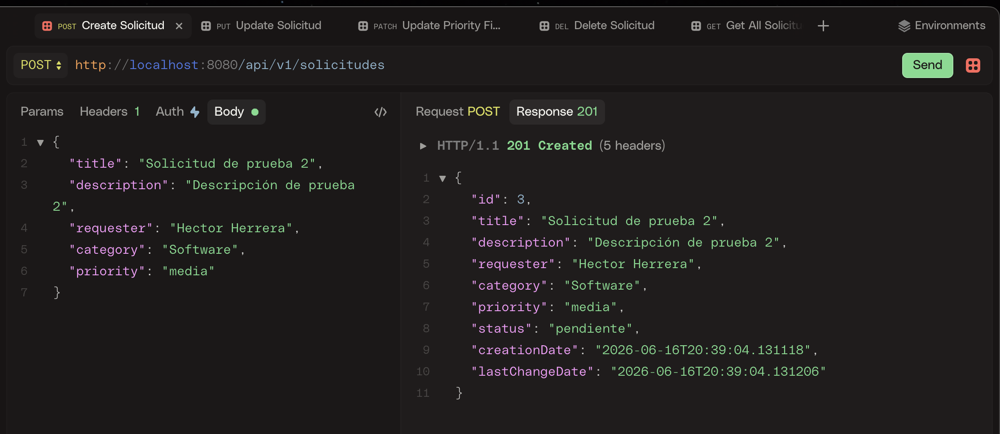
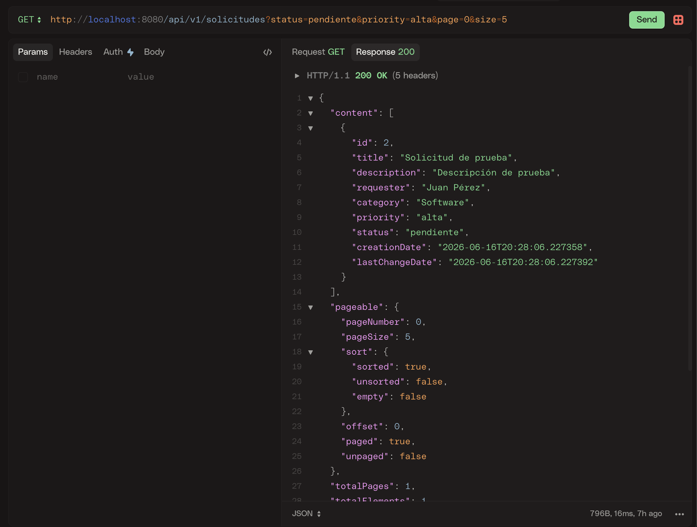
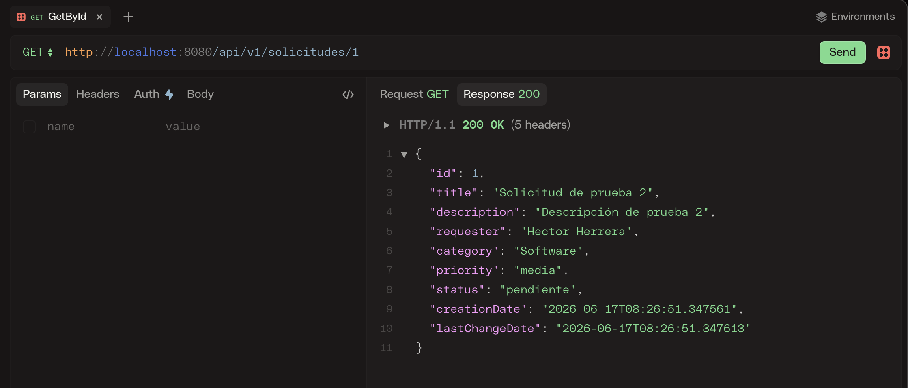
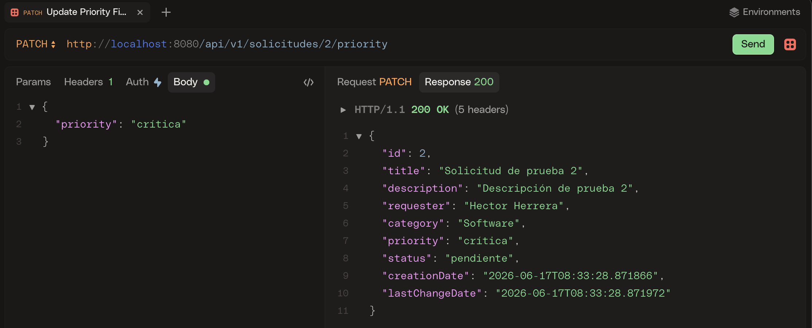
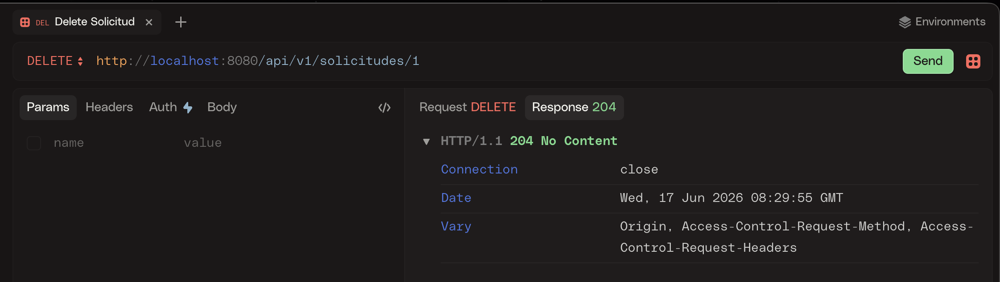
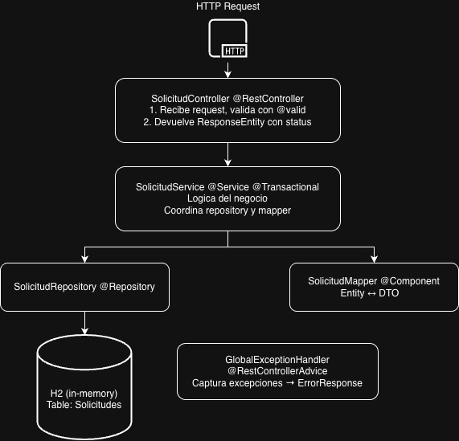

# Gestor de Solicitudes - API REST

Un challenge propuesto por Scotiabank, es una API REST desarrollada con Spring Boot 3.2 para la gestión del ciclo de vida de solicitudes internas. Permite crear, consultar, actualizar y eliminar solicitudes con soporte a filtros, paginación y manejo de errores.

Diseñado como backend desacoplado listo para conectarse a cualquier frontend (React, Angular, mobile) mediante endpoints y CORS configurado asi como tambien contratos claros de DTO.

---

## Tabla de Contenidos

- [1. Descripción General](#-descripción-general)
- [2. Características](#-características)
- [3. Stack Tecnológico](#-stack-tecnológico)
- [4. Requisitos Previos](#-requisitos-previos)
- [5. Instalación](#-instalación)
- [6. Configuración](#-configuración)
- [7. Uso - Ejemplos curl, HTTPie](#-uso--ejemplos-curl)
- [8. Endpoints REST](#-endpoints-rest)
- [9. Estructura del Proyecto](#-estructura-del-proyecto)
- [10. Testing](#-testing)
- [11. Docker](#-docker)
- [12. Decisiones Técnicas](#-decisiones-técnicas)
- [13. Supuestos](#-supuestos)
- [14. Despliegue en AWS](#-despliegue-en-aws)

---

## 1. Descripción General

El **Gestor de Solicitudes** es una API REST para equipos internos que necesitan registrar y dar seguimiento a solicitudes de trabajo. Cada solicitud tiene un ciclo de vida definido (pendiente → en revisión → aprobada/rechazada → cerrada), una prioridad asignada y una categoría.

**Casos de uso principales:**
- Registrar una nueva solicitud con título, descripción, solicitante y prioridad
- Consultar el listado de solicitudes con filtros por estado, prioridad y búsqueda por título
- Actualizar el estado o la prioridad de una solicitud existente
- Eliminar solicitudes cerradas o incorrectas

---

## 2. Características

| Característica | Detalle |
|---|---|
| **CRUD Completo** | Crear, listar, obtener por ID, actualizar, eliminar |
| **Gestión de Estados** | 5 estados: pendiente, en revisión, aprobada, rechazada, cerrada |
| **Prioridades** | 4 niveles: baja, media, alta, crítica |
| **Categorías** | 5 categorías: Infraestructura, Software, Hardware, Redes, Soporte Técnico |
| **Búsqueda y Filtrado** | Filtros opcionales por estado y prioridad + búsqueda por título |
| **Paginación** | Page/size configurable, ordenado por fecha descendente |
| **Validaciones** | `@NotBlank`, `@Size`, `@ValidEnum` en todos los DTOs |
| **Manejo de Errores** | `GlobalExceptionHandler` con respuestas JSON consistentes |
| **Timestamps automáticos** | `creationDate` y `lastChangeDate` gestionados por Hibernate |
| **Docker** | Imagen multistage, docker-compose con health checks |
| **Testing** | 39 tests unitarios e integración, ~90% cobertura |

---

## 3. Stack Tecnológico

| Capa | Tecnología | Versión |
|---|---|---|
| Lenguaje | Java | 17+ |
| Framework | Spring Boot | 3.2.5 |
| Persistencia | Spring Data JPA | 3.2.5 |
| Base de datos | H2 (en memoria) | 2.2.x |
| Validación | Jakarta Validation | 3.0 |
| Build | Maven | 3.9+ |
| Contenedores | Docker + Docker Compose | 20.10+ / 2.0+ |
| Testing | JUnit 5 + Mockito | 5.x / 5.x |
| IDE recomendado | IntelliJ IDEA | 2023+ |

---

## 4. Requisitos Previos

### Opción A - Desarrollo local (sin Docker)

- Java 17 o superior
- Maven 3.9+
********
```bash
# Verificar instalaciones
java -version
mvn --version
```

### Opción B - Con Docker

- Docker 20.10+
- Docker Compose 2.0+

```bash
# Verificar instalaciones
docker --version
docker compose version
```

---

## 5. Instalación

### A) Ejecución local

```bash
# 1. Clonar el repositorio
git clone https://github.com/hectorsum/scotiabank-challenge.git
cd scotiabank-challenge/backend/solicitudes-backend

# 2. Compilar e instalar dependencias
mvn clean install

# 3. Ejecutar la aplicación
mvn spring-boot:run

# 4. Verificar que está corriendo
curl http://localhost:8080/actuator/health
# {"status":"UP"}
```

### B) Ejecución con Docker

```bash
# 1. Clonar el repositorio
git clone https://github.com/hectorsum/scotiabank-challenge.git
cd scotiabank-challenge/backend/solicitudes-backend

# 2. Build y arrancar en background
docker-compose up -d --build

# 3. Ver logs en tiempo real
docker-compose logs -f api

# 4. Verificar
curl http://localhost:8080/actuator/health
```

### C) Ejecución en IntelliJ IDEA

1. `File → Open` → seleccionar carpeta `solicitudes-backend`
2. Esperar a que Maven indexe las dependencias
3. Abrir `SolicitudesApplication.java`

---

## 6. Configuración

### application.yml (desarrollo local)

```yaml
server:
  port: 8080

spring:
  datasource:
    url: jdbc:h2:mem:solicitudesdb
    username: hectorsum
    password:
  jpa:
    hibernate:
      ddl-auto: create-drop
  h2:
    console:
      enabled: true
      path: /h2-console
```

### Variables de entorno (Docker)

Todas las propiedades de Spring Boot se pueden sobreescribir con variables de entorno. Ver `.env.example` para la lista completa.

---

## 7. Uso - Ejemplos curl

### Crear solicitud

```bash
curl -X POST http://localhost:8080/api/v1/solicitudes \
  -H "Content-Type: application/json" \
  -d '{
    "title": "Actualización de servidor web",
    "description": "Necesitamos actualizar nginx a la versión más reciente por vulnerabilidades de seguridad.",
    "requester": "Juan Pérez",
    "category": "Infraestructura",
    "priority": "alta"
  }'
```

```json
{
  "id": 1,
  "title": "Actualización de servidor web",
  "description": "Necesitamos actualizar nginx a la versión más reciente por vulnerabilidades de seguridad.",
  "requester": "Juan Pérez",
  "category": "Infraestructura",
  "priority": "alta",
  "status": "pendiente",
  "creationDate": "2026-06-17T10:00:00",
  "lastChangeDate": "2026-06-17T10:00:00"
}
```



---

### Listar solicitudes (con filtros)

```bash
# Todas las solicitudes (paginado)
curl "http://localhost:8080/api/v1/solicitudes?page=0&size=10"

# Filtrar por estado
curl "http://localhost:8080/api/v1/solicitudes?status=pendiente"

# Filtrar por prioridad
curl "http://localhost:8080/api/v1/solicitudes?priority=alta"

# Buscar por título
curl "http://localhost:8080/api/v1/solicitudes?search=servidor"

# Combinar filtros
curl "http://localhost:8080/api/v1/solicitudes?status=pendiente&priority=alta&page=0&size=5"
```

```json
{
  "content": [
    {
      "id": 1,
      "title": "Actualización de servidor web",
      "priority": "alta",
      "status": "pendiente",
      "creationDate": "2026-06-17T10:00:00"
    }
  ],
  "totalElements": 1,
  "totalPages": 1,
  "size": 10,
  "number": 0
}
```



---

### Obtener solicitud por ID

```bash
curl http://localhost:8080/api/v1/solicitudes/1
```


---

### Actualizar solicitud

```bash
curl -X PUT http://localhost:8080/api/v1/solicitudes/1 \
  -H "Content-Type: application/json" \
  -d '{
    "title": "Actualización de servidor web - Urgente",
    "description": "Descripción actualizada.",
    "category": "Infraestructura",
    "priority": "crítica",
    "status": "en revisión"
  }'
```


---

### Actualizar solo prioridad

```bash
curl -X PATCH http://localhost:8080/api/v1/solicitudes/1/priority \
  -H "Content-Type: application/json" \
  -d '{"priority": "crítica"}'
```



---

### Eliminar solicitud

```bash
curl -X DELETE http://localhost:8080/api/v1/solicitudes/1
# Respuesta: HTTP 204 No Content
```



---

### Ejemplo de error (validación)

```bash
curl -X POST http://localhost:8080/api/v1/solicitudes \
  -H "Content-Type: application/json" \
  -d '{"title": "", "priority": "invalida"}'
```

```json
{
  "timestamp": "2026-06-17T10:00:00",
  "status": 400,
  "error": "Validation Failed",
  "message": "Error en la validación de datos",
  "path": "/api/v1/solicitudes",
  "validationErrors": {
    "title": "El título es obligatorio",
    "description": "La descripción es obligatoria",
    "requester": "El solicitante es obligatorio",
    "priority": "Prioridad inválida. Valores: baja, media, alta, crítica",
    "category": "La categoría es obligatoria"
  }
}
```

---

## 8. Endpoints REST

| Método | Endpoint | Descripción | Status |
|---|---|---|---|
| `GET` | `/api/v1/solicitudes` | Listar con paginación y filtros | 200 |
| `GET` | `/api/v1/solicitudes/{id}` | Obtener por ID | 200 / 404 |
| `POST` | `/api/v1/solicitudes` | Crear nueva solicitud | 201 / 400 |
| `PUT` | `/api/v1/solicitudes/{id}` | Actualizar todos los campos | 200 / 400 / 404 |
| `PATCH` | `/api/v1/solicitudes/{id}/priority` | Actualizar solo prioridad | 200 / 400 / 404 |
| `DELETE` | `/api/v1/solicitudes/{id}` | Eliminar solicitud | 204 / 404 |

### Parámetros de consulta - GET /api/v1/solicitudes

| Parámetro | Tipo | Default | Descripción |
|---|---|---|---|
| `page` | int | 0 | Número de página (0-based) |
| `size` | int | 10 | Elementos por página |
| `status` | String | null | Filtrar por estado |
| `priority` | String | null | Filtrar por prioridad |
| `search` | String | null | Buscar en título (case-insensitive) |

### SolicitudCreateDTO

| Campo | Tipo | Validación |
|---|---|---|
| `title` | String | Obligatorio, max 100 caracteres |
| `description` | String | Obligatorio, max 1000 caracteres |
| `requester` | String | Obligatorio, max 100 caracteres |
| `category` | String | Obligatorio, valores: Infraestructura, Software, Hardware, Redes, Soporte Técnico |
| `priority` | String | Obligatorio, valores: baja, media, alta, crítica |

### SolicitudUpdateDTO

| Campo | Tipo | Validación |
|---|---|---|
| `title` | String | Obligatorio, max 100 caracteres |
| `description` | String | Obligatorio, max 1000 caracteres |
| `category` | String | Obligatorio, valores válidos de Category |
| `priority` | String | Obligatorio, valores válidos de Priority |
| `status` | String | Obligatorio, valores: pendiente, en revisión, aprobada, rechazada, cerrada |

### SolicitudPriorityUpdateDTO

| Campo | Tipo | Validación |
|---|---|---|
| `priority` | String | Obligatorio, valores: baja, media, alta, crítica |

### SolicitudDTO (respuesta)

| Campo | Tipo | Descripción |
|---|---|---|
| `id` | Long | Identificador único |
| `title` | String | Título de la solicitud |
| `description` | String | Descripción detallada |
| `requester` | String | Nombre del solicitante |
| `category` | String | Categoría (label en español) |
| `priority` | String | Prioridad (label en español) |
| `status` | String | Estado actual (label en español) |
| `creationDate` | LocalDateTime | Fecha de creación (auto) |
| `lastChangeDate` | LocalDateTime | Última modificación (auto) |

### ErrorResponse

| Campo | Tipo | Descripción |
|---|---|---|
| `timestamp` | LocalDateTime | Momento del error |
| `status` | int | Código HTTP |
| `error` | String | Tipo de error |
| `message` | String | Mensaje descriptivo |
| `path` | String | Endpoint que falló |
| `validationErrors` | Map | Errores por campo (solo en 400) |

---

## 9. Estructura del Proyecto

```
solicitudes-backend/
├── Dockerfile                          # Build multistage
├── docker-compose.yml                  # Orquestación local
├── pom.xml                             # Dependencias Maven
├── .env.example                        # Variables de entorno ejemplo
└── src/
    ├── main/
    │   ├── java/com/periferia/solicitudes/
    │   │   ├── SolicitudesApplication.java     # Punto de entrada
    │   │   ├── config/
    │   │   │   └── CorsConfig.java             # Configuración CORS
    │   │   ├── controller/
    │   │   │   └── SolicitudController.java    # Endpoints REST
    │   │   ├── service/
    │   │   │   └── SolicitudService.java       # Lógica de negocio
    │   │   ├── repository/
    │   │   │   └── SolicitudRepository.java    # Acceso a datos
    │   │   ├── entity/
    │   │   │   ├── Solicitud.java              # Entidad JPA
    │   │   │   └── enums/
    │   │   │       ├── Priority.java
    │   │   │       ├── Status.java
    │   │   │       └── Category.java
    │   │   ├── dto/
    │   │   │   ├── SolicitudDTO.java
    │   │   │   ├── SolicitudCreateDTO.java
    │   │   │   ├── SolicitudUpdateDTO.java
    │   │   │   └── SolicitudPriorityUpdateDTO.java
    │   │   ├── mapper/
    │   │   │   └── SolicitudMapper.java        # Conversión Entity -> DTO
    │   │   ├── exception/
    │   │   │   ├── EntityNotFoundException.java
    │   │   │   ├── GlobalExceptionHandler.java
    │   │   │   └── ErrorResponse.java
    │   │   └── validation/
    │   │       ├── ValidEnum.java              # Anotación custom
    │   │       └── EnumValidator.java          # Lógica de validación
    │   └── resources/
    │       └── application.yml
    └── test/
        ├── java/com/periferia/solicitudes/
        │   ├── SolicitudesApplicationTests.java
        │   ├── controller/
        │   │   └── SolicitudControllerTest.java
        │   ├── service/
        │   │   └── SolicitudServiceTest.java
        │   └── repository/
        │       └── SolicitudRepositoryTest.java
        └── resources/
            └── mockito-extensions/
                └── org.mockito.plugins.MockMaker  # mock-maker-subclass (Java 26)
```

### Diagrama de capas



---

## 10. Testing

```bash
# Ejecutar todos los tests
mvn clean test

# Ejecutar test específico
mvn test -Dtest=SolicitudServiceTest

# Ejecutar tests de una clase con método específico
mvn test -Dtest=SolicitudControllerTest#debeCrearSolicitud

```

### Resumen de tests

| Componente | Tests | Tipo |
|---|---|---|
| `SolicitudServiceTest` | 15 | Unitarios (Mockito) |
| `SolicitudControllerTest` | 15 | Integración (MockMvc) |
| `SolicitudRepositoryTest` | 8 | Integración (H2) |
| `SolicitudesApplicationTests` | 1 | Contexto Spring |
| **Total** | **39** | **~90% cobertura** |

---

## 11. Docker

```bash
# Construir imagen manualmente
docker build -t solicitudes-api .

# Ejecutar container standalone
docker run -p 8080:8080 solicitudes-api

# Docker Compose - levantar todo
docker-compose up -d --build

# Ver logs en tiempo real
docker-compose logs -f api

# Ver estado de contenedores
docker-compose ps

# Parar y eliminar contenedores
docker-compose down

# Parar y eliminar contenedores + imágenes
docker-compose down --rmi all
```

### Dockerfile multistage

El build usa dos stages para minimizar el tamaño de la imagen final:

```
Stage 1 (builder):  maven:3.9-eclipse-temurin-21  (~700MB)
  └── Descarga dependencias
  └── Compila el proyecto
  └── Genera el JAR

Stage 2 (runtime):  eclipse-temurin:21-jre-alpine  (~85MB)
  └── Copia solo el JAR del stage anterior
  └── Sin código fuente
  └── Sin Maven
  └── Sin JDK (solo JRE)

Imagen final: ~185MB  (vs ~700MB con un stage único)
```

**Ventajas:**
- Imagen 4x más pequeña
- Sin código fuente en producción
- Superficie de ataque reducida
- Deploy más rápido

---

## 12. Decisiones Técnicas

| Decisión | Alternativa | Justificación                                                                                                                                                                   |
|---|---|---------------------------------------------------------------------------------------------------------------------------------------------------------------------------------|
| **H2 en memoria** | PostgreSQL | Cero configuración para desarrollo y tests debido a que es un challenge con tiempo limitado. Fácil swap a PostgreSQL via variables de entorno en caso el proyecto sea escalable |
| **Spring Data JPA** | JDBC puro, MyBatis | ORM estándar de Java, reduce boilerplate, queries generadas automáticamente, especialmente para un desarrollo rapido.                                                           |
| **DTOs por caso de uso** | Un DTO genérico | Cada endpoint recibe exactamente lo que necesita. Create sin ID, Update sin requester, PriorityUpdate con un solo campo. Menor acoplamiento.                                    |
| **Mapper manual** | MapStruct, ModelMapper | Sin dependencias extra, compatible con cualquier versión de Java, código explícito y fácil de debuggear.                                                                        |
| **Validaciones en DTO** | Validar en service | Falla rápido antes de llegar al service. Mensajes de error claros por campo.                                                                                                    |
| **GlobalExceptionHandler** | Try-catch en cada controller | Un solo punto de manejo de errores. Respuestas JSON consistentes en toda la API.                                                                                                |
| **JpaSpecificationExecutor** | Queries individuales por filtro | Filtros combinables dinámicamente sin multiplicar métodos en el repository.                                                                                                     |
| **`create-drop` en JPA** | `update` | BD siempre limpia al reiniciar, ideal para desarrollo y tests. Cambiar a `update` en producción.                                                                                |
| **JUnit 5 + Mockito** | TestNG, EasyMock | Stack estándar de Spring Boot. Integración nativa con MockMvc para tests de controller.                                                                                         |
| **Docker multistage** | Single stage | Imagen final 4x más pequeña, sin código fuente en producción.                                                                                                                   |

---

## 13. Supuestos

- **H2 es suficiente** para el ambiente de desarrollo y demo, especialmente es bueno para este challenge. A futuro por temas de escalabilidad podemos swapear a PostgreSQL sin cambiar código.
- **Sin HTTPS**, responsabilidad del reverse proxy (nginx, AWS ALB) en producción.
- **Sin autenticación/autorización**: fuera del scope de los requisitos de este challenge.
- **Sin rate limiting**: se implementaría a nivel de API Gateway en producción para limitar o por temas de ataque DDoS
- **CORS configurado** para `localhost:3000`, usando capa frontend en React en desarrollo local.
- **HTTP 204** en DELETE, sin body en respuesta exitosa de eliminación.
- **Paginación default** `size=10`, `page=0`, ordenado por `creationDate DESC`.
- **Timestamps automáticos**: `creationDate` y `lastChangeDate` los gestiona Hibernate, no el cliente.
- **Status inicial** de toda solicitud nueva es `PENDIENTE`.

---

## 14. Despliegue en AWS

La API está desplegada en **AWS ECS Fargate** usando una imagen Docker almacenada en **Amazon ECR**.

### Infraestructura

```
ECR (imagen Docker)
  └── ECS Fargate (container corriendo)
        └── URL pública con IP efímera
```

| Componente | Detalle |
|---|---|
| **Región** | us-east-2 (Ohio) |
| **Cluster** | ECS Fargate |
| **CPU / RAM** | 0.25 vCPU / 0.5 GB |
| **Puerto** | 8080 |

### URL pública

> **Nota:** La IP es efímera — cambia cada vez que el task se reinicia. Para obtener la URL actual: ECS → Clusters → Tasks → task RUNNING → Public IP.

```
http://<public-ip>:8080/api/v1/solicitudes
http://<public-ip>:8080/actuator/health
```

### Activar / desactivar el servicio

Para evitar costos innecesarios el servicio se apaga cuando no está en uso.

**Apagar:**
1. ECS → Clusters → tu cluster → Services → tu service
2. **Update service** → Desired tasks: **0** → Update

**Encender:**
1. ECS → Clusters → tu cluster → Services → tu service
2. **Update service** → Desired tasks: **1** → Update
3. Esperar ~1 minuto → copiar la nueva Public IP del task RUNNING

### Flujo de deploy

```bash
# 1. Build para AMD64 (requerido para Fargate)
docker buildx build --platform linux/amd64 -t solicitudes-backend .

# 2. Tag
docker tag solicitudes-backend:latest \
  <account-id>.dkr.ecr.us-east-2.amazonaws.com/solicitudes-backend:latest

# 3. Login ECR
aws ecr get-login-password --region us-east-2 | docker login --username AWS \
  --password-stdin <account-id>.dkr.ecr.us-east-2.amazonaws.com

# 4. Push
docker push <account-id>.dkr.ecr.us-east-2.amazonaws.com/solicitudes-backend:latest
```

Luego en ECS → Service → **Update service** → **Force new deployment**.