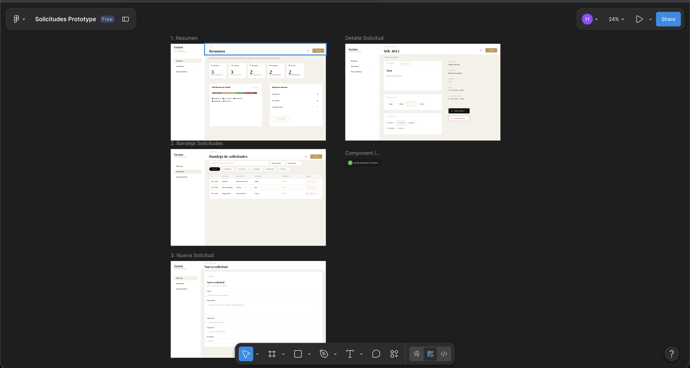
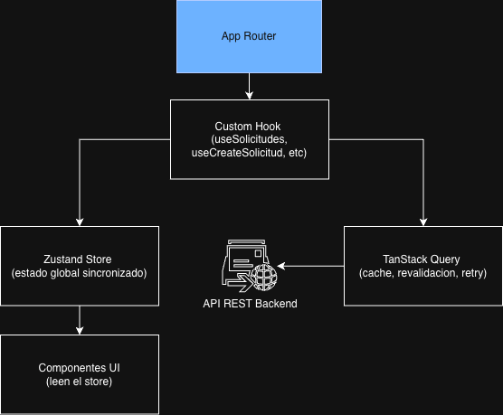

# Gestor de Solicitudes - Frontend

Challenge de Scotiabank - para la gestión del ciclo de vida de solicitudes internas. Construida con Next.js 14 App Router, TypeScript, TanStack Query y Zustand. Consume la API REST del backend desplegada en AWS ECS (producción).

**Prototipo Figma:** [Figma Link](https://www.figma.com/design/32smyivWPfCLVinbSuitdC/Solicitudes-Prototype?node-id=0-1&m=dev&t=fmLIZyk8YBDovmnG-1)



---

## Tabla de contenidos

- [1. Características](#1-características)
- [2. Stack tecnológico](#2-stack-tecnológico)
- [3. Requisitos previos](#3-requisitos-previos)
- [4. Setup e instalación](#4-setup-e-instalación)
- [5. Estructura del proyecto](#5-estructura-del-proyecto)
- [6. Cómo ejecutar](#6-cómo-ejecutar)
- [7. Docker](#7-docker)
- [8. Integración con la API](#8-integración-con-la-api)
- [9. Testing](#9-testing)
- [10. Arquitectura aplicada](#10-arquitectura-aplicada)
- [11. Decisiones técnicas](#11-decisiones-técnicas)
- [12. Supuestos](#12-supuestos)
- [13. Deployment](#13-deployment)
- [14. Troubleshooting](#14-troubleshooting)

---

## 1. Características

| Característica | Detalle |
|---|---|
| **Bandeja de solicitudes** | Tabla con filtros por estado, prioridad, búsqueda y ordenamiento |
| **Dashboard** | Resumen de estados, solicitudes críticas y actividad reciente |
| **Crear / Editar** | Formulario con validación Zod en el cliente |
| **Detalle** | Cambio de prioridad y estado desde la vista de detalle |
| **Responsive** | Layout de tarjetas en mobile, tabla en desktop |
| **Estado global** | Zustand sincronizado con el servidor vía TanStack Query |
| **Notificaciones** | Toast de feedback en operaciones CRUD |
| **Testing** | 28 tests unitarios (Jest + RTL) + 5 specs E2E (Playwright) |
| **Docker** | Imagen multistage con `output: standalone` de Next.js |

---

## 2. Stack tecnológico

| Capa            | Tecnología                   | Versión     |
| -----------------| ------------------------------| -------------|
| Framework       | Next.js (App Router)         | 14.x        |
| Lenguaje        | TypeScript                   | 5.x         |
| Estilos         | Tailwind CSS                 | 3.x         |
| Server state    | TanStack Query               | 5.x         |
| Client state    | Zustand                      | 4.x         |
| Validación      | Zod                          | 3.x         |
| HTTP client     | Axios                        | 1.x         |
| Tests unitarios | Jest + React Testing Library | 29.x / 14.x |
| Tests E2E       | Playwright                   | 1.40+       |
| Runtime         | Node.js                      | 20+         |
| Contenedor      | Docker (multistage)          | 20.10+      |

---

## 3. Requisitos previos

### Opción A - Desarrollo local

- Node.js 20+
- npm 9+
- Backend corriendo en `localhost:8080` o acceso al backend en AWS

```bash
node -v
npm -v
```

### Opción B - Docker

- Docker 20.10+
- Docker Compose 2.0+

```bash
docker --version
docker compose version
```

---

## 4. Setup e instalación

```bash
cd frontend
npm install
cp .env.example .env.local
```

El archivo `.env.example` apunta a `localhost:8080` para desarrollo local. Para usar el backend en AWS, edita `.env.local`:

```bash
NEXT_PUBLIC_API_URL=http://3.15.154.47:8080
```

> `.env.local` está en `.gitignore` y nunca se commitea. `.env.example` sí se commitea - contiene la configuración de referencia sin secretos.

---

## 5. Estructura del proyecto

```
frontend/
├── src/
│   ├── app/                        # Rutas - Next.js 14 App Router
│   │   ├── page.tsx                # Dashboard (/)
│   │   ├── layout.tsx              # Root layout (Server Component)
│   │   ├── providers.tsx           # QueryClientProvider (Client Component)
│   │   └── solicitudes/
│   │       ├── page.tsx            # Bandeja (/solicitudes)
│   │       ├── nueva/page.tsx      # Crear solicitud
│   │       └── [id]/
│   │           ├── page.tsx        # Detalle (/solicitudes/:id)
│   │           └── editar/page.tsx # Editar (/solicitudes/:id/editar)
│   ├── components/
│   │   ├── layout/                 # AppLayout, Sidebar, Header
│   │   ├── pages/                  # Dashboard, Bandeja, Detalle, Form
│   │   └── ui/                     # EstadoBadge, PrioridadBadge, Toast, LoadingSkeleton
│   ├── hooks/                      # Custom hooks (lógica de negocio + fetch)
│   │   ├── useSolicitudes.ts       # Lista paginada con debounce de búsqueda
│   │   ├── useSolicitud.ts         # Solicitud individual por id
│   │   ├── useCreateSolicitud.ts   # Mutación POST
│   │   ├── useUpdateSolicitud.ts   # Mutación PUT + PATCH prioridad
│   │   ├── useDeleteSolicitud.ts   # Mutación DELETE
│   │   └── useForm.ts              # Formulario genérico con Zod
│   ├── services/
│   │   ├── api.ts                  # Instancia axios con interceptores
│   │   └── solicitudService.ts     # Funciones de acceso a la API
│   ├── store/
│   │   ├── solicitudStore.ts       # Estado global de solicitudes (Zustand)
│   │   └── uiStore.ts              # Estado UI (sidebar, notificaciones)
│   ├── types/                      # Tipos TypeScript: Solicitud, Status, Priority, Category
│   ├── lib/                        # designTokens, constantes de diseño
│   └── config/
│       └── api.ts                  # baseURL, timeout, endpoints
├── e2e/                            # Specs Playwright
├── src/__tests__/                  # Tests Jest por capa
├── Dockerfile                      # Build multistage
├── .env.example                    # Variables de referencia
├── jest.config.js
├── playwright.config.ts
└── next.config.mjs
```

---

## 6. Cómo ejecutar

### Desarrollo local

```bash
npm run dev
```

Disponible en `http://localhost:3000` con hot reload.

### Build de producción

```bash
npm run build
npm start
```

### Scripts disponibles

```bash
npm run dev           # Dev server con hot reload
npm run build         # Build de producción
npm start             # Servidor de producción
npm run lint          # ESLint
npm run type-check    # TypeScript sin emitir archivos
npm run format        # Prettier
npm test              # Tests unitarios
npm run test:coverage # Tests + reporte de cobertura HTML
npm run e2e           # Tests E2E Playwright
```

---

## 7. Docker

El build de Docker apunta al backend local por defecto. Dentro de un contenedor Docker, `localhost` se refiere al propio contenedor — no a tu máquina host. Por eso se usa `host.docker.internal`, que Docker Desktop resuelve hacia el host donde corre el backend.

> Para producción (Vercel), la URL del backend se configura como variable de entorno en el dashboard de Vercel. Ver sección [13. Deployment](#13-deployment).

### Con docker-compose (recomendado)

```bash
# Desde la raíz del repositorio
# Requiere el backend corriendo localmente en localhost:8080
docker compose up --build
```

Disponible en `http://localhost:3000`.

### Con Docker directamente

```bash
docker build -t solicitudes-frontend ./frontend
docker run -p 3000:3000 solicitudes-frontend
```

### Apuntar a otro backend

```bash
NEXT_PUBLIC_API_URL=http://otra-url.com docker compose up --build
```

### Imagen multistage

```
Stage 1 (builder):  node:20-alpine  — instala deps y compila Next.js
Stage 2 (runtime):  node:20-alpine  — copia solo .next/standalone + static

Imagen final: ~180MB  (vs ~900MB con single stage + node_modules completo)
```

---

## 8. Integración con la API

### Backend

| Entorno | URL |
|---|---|
| Local | `http://localhost:8080` |
| AWS ECS | `http://3.15.154.47:8080` |

### Endpoints consumidos

| Método | Endpoint | Hook |
|---|---|---|
| GET | `/api/v1/solicitudes` | `useSolicitudes` |
| GET | `/api/v1/solicitudes/:id` | `useSolicitud` |
| POST | `/api/v1/solicitudes` | `useCreateSolicitud` |
| PUT | `/api/v1/solicitudes/:id` | `useUpdateSolicitud` |
| PATCH | `/api/v1/solicitudes/:id/priority` | `useUpdateSolicitud` |
| DELETE | `/api/v1/solicitudes/:id` | `useDeleteSolicitud` |

### Variables de ambiente

```bash
NEXT_PUBLIC_API_URL=http://localhost:8080   # URL base del backend
NEXT_PUBLIC_API_TIMEOUT=30000               # Timeout de requests en ms
```

### Manejo de errores

Axios intercepta todos los errores HTTP y los convierte en mensajes legibles. Los hooks capturan el error y lo exponen al componente. TanStack Query reintenta automáticamente hasta 3 veces con backoff exponencial.

---

## 9. Testing

### Tests unitarios - Jest + React Testing Library

```bash
# Correr todos los tests
npm test

# Con reporte de cobertura HTML
npm run test:coverage

# Modo watch durante desarrollo
npm run test:watch
```

### Resumen de tests

| Suite | Tests | Qué verifica |
|---|---|---|
| `useSolicitudes` | 2 | Hook con QueryClient wrapper, filtros al servicio |
| `useSolicitud` | 2 | Fetch por id, `enabled: !!id` |
| `useCreateSolicitud` | 2 | Mutación POST, ciclo success → reset |
| `useForm` | 4 | Validación Zod, bloqueo de submit, reset |
| `solicitudService` | 5 | Llamadas HTTP correctas, error 404 legible |
| `solicitudStore` | 4 | CRUD en store, efectos en totalElements |
| `uiStore` | 3 | Toggle sidebar, notificaciones |
| `EstadoBadge` | 2 | Render por estado, tamaños sm/md |
| `Toast` | 2 | Fake timers, onDismiss en el ms exacto |
| `PrioridadBadge` | 1 | Render por prioridad |
| `LoadingSkeleton` | 1 | Elementos de skeleton y texto de carga |
| **Total** | **28** | |


### Tests E2E - Playwright

Requieren frontend en `http://localhost:3000` y backend accesible.

```bash
# Instalar browser (primera vez)
npx playwright install chromium

# Correr todos los specs
npm run e2e

# Reporte HTML interactivo
npm run e2e:report

# Modo UI con inspector
npm run e2e:ui
```

| Spec                     | Escenarios                                         |
| --------------------------| ----------------------------------------------------|
| `dashboard.spec.ts`      | Carga, navegación, cards de estado                 |
| `solicitudes.spec.ts`    | Filtros, búsqueda, chips, navegación a detalle     |
| `crear.spec.ts`          | Validaciones, selección de prioridad, submit       |
| `detalle-editar.spec.ts` | Cambio de prioridad/estado, formulario pre-cargado |
| `delete.spec.ts`         | Confirmación, cancelar cierre                      |

---

## 10. Arquitectura aplicada

### Flujo de datos



### Separación de responsabilidades

| Capa                | Responsabilidad                                    |
| ---------------------| ----------------------------------------------------|
| `app/` (páginas)    | Routing, composición, pasar props a componentes    |
| `components/pages/` | UI de cada vista, sin lógica de fetch              |
| `hooks/`            | Toda la lógica de fetch, mutaciones y side effects |
| `services/`         | Llamadas HTTP puras, sin estado                    |
| `store/`            | Estado global del cliente (no del servidor)        |
| `types/`            | Contratos TypeScript compartidos                   |

### Patrón de hooks con TanStack Query

Los hooks siguen un patrón consistente: llaman al servicio, sincronizan el resultado con el store de Zustand para que otros componentes (como el sidebar) puedan leer el total sin hacer otra petición, y exponen `loading`, `error` y los datos al componente.

### Server Components vs Client Components

Next.js 14 requiere declarar `'use client'` explícitamente. `layout.tsx` permanece como Server Component para poder exportar `metadata`. `providers.tsx` es un Client Component separado que envuelve la aplicación con `QueryClientProvider`.

---

## 11. Decisiones técnicas

| Decisión | Alternativa | Justificación |
|---|---|---|
| **Next.js 14 App Router** | Pages Router, Vite + React | Routing basado en carpetas, Server Components nativos, layout anidado sin configuración extra |
| **TanStack Query v5** | SWR, Redux Toolkit Query | Caché automático, deduplicación de peticiones, retry con backoff, invalidación granular por query key |
| **Zustand** | Redux, Context API | API mínima sin boilerplate, fácil de testear con `getState`/`setState` directamente, compatible con SSR |
| **Hooks por operación** | Un hook genérico | `useCreateSolicitud`, `useUpdateSolicitud`, etc. son independientes y testeables por separado |
| **Zod en useForm** | React Hook Form, Formik | Validación con inferencia de tipos TypeScript, sin dependencias extra más allá de Zod |
| **Axios sobre fetch nativo** | fetch, ky | Interceptores de respuesta, timeout configurable, manejo de errores centralizado en un solo lugar |
| **Tailwind CSS** | CSS Modules, styled-components | Clases utilitarias sin cambiar de archivo, consistencia con el design system, fácil responsive con prefijos `md:` |
| **output: standalone** en Next.js | Node.js server completo | La imagen Docker final copia solo los archivos necesarios, reduciendo el tamaño de ~900MB a ~180MB |
| **Debounce de 150ms** | Sin debounce, 500ms | Sin debounce se dispara una petición por tecla. 500ms se siente lento con BD en memoria. 150ms es imperceptible pero evita peticiones redundantes |
| **Query separada para conteos** | Calcular del resultado filtrado | Al filtrar por estado, los conteos de los chips deben reflejar el total sin ese filtro. Una query sin `status` da los números correctos independientemente del chip activo |

---

## 12. Supuestos

- **Sin autenticación**: fuera del scope del challenge. En producción se agregaría un middleware de Next.js que verifique el token antes de cada ruta protegida.
- **BD en memoria en el backend**: los datos se pierden al reiniciar el servicio. En el frontend no hacemos ningún intento de cachear datos entre sesiones.
- **Paginación client-side para ordenamiento**: el backend devuelve los datos ordenados por fecha. El ordenamiento por prioridad y título se hace en el cliente sobre la página actual.
- **NEXT_PUBLIC_API_URL en build time**: Next.js expone variables `NEXT_PUBLIC_*` al bundle del cliente en tiempo de compilación, no en runtime. Cambiar la variable sin rebuildar no tiene efecto.
- **`host.docker.internal` en Docker**: permite que el contenedor alcance el backend corriendo en el host. Funciona en Docker Desktop (Mac/Windows). En Linux puede requerirse `--add-host=host.docker.internal:host-gateway`.
- **Sin HTTPS**: responsabilidad del reverse proxy o del balanceador en producción.
- **IP de AWS es efímera**: cambia cada vez que el task de ECS se reinicia. Si el backend no responde, obtener la nueva IP desde la consola de ECS.

---

## 13. Deployment

### Entornos

| Entorno               | Frontend                                   | Backend URL                                   |
| -----------------------| --------------------------------------------| -----------------------------------------------|
| Local (`npm run dev`) | `localhost:3000`                           | `localhost:8080` (`.env.local`)               |
| Docker local          | `localhost:3000`                           | `host.docker.internal:8080` (default)         |
| Vercel (producción)   | `https://scotiabank-challenge.vercel.app/` | `http://3.15.154.47:8080` (env var en Vercel) |

### Deploy en Vercel

Vercel es el entorno de producción. La URL del backend de AWS se configura como variable de entorno en el dashboard, no en el código.

1. Conectar el repositorio en [vercel.com](https://vercel.com)
2. En **Settings → Environment Variables**, agregar:
   ```
   NEXT_PUBLIC_API_URL = http://3.15.154.47:8080
   ```
3. Hacer deploy — Vercel inyecta la variable en el build automáticamente

No se necesita `Dockerfile` para Vercel; detecta Next.js automáticamente.

### Build de imagen Docker para producción

Si se necesita deploy en otro entorno (ECS, GCP, etc.):

```bash
docker build \
  --build-arg NEXT_PUBLIC_API_URL=http://3.15.154.47:8080 \
  -t solicitudes-frontend:latest \
  ./frontend
```